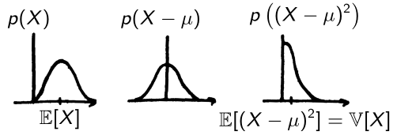
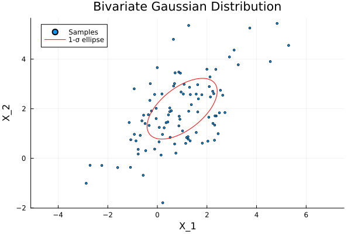

# Gaussian random variables
## Definition
A Gaussian (or **normal**) **random variable** \(X\) has the probability density function (PDF)
$$
f_X(x) = \frac{1}{\sqrt{2\pi\sigma^2}}e^{-\frac{1}{2}\frac{(x-\mu)^2}{\sigma^2}}
$$
!!! note "Dimension \(n\)"
     $$
     f_X(x) = \frac{1}{(2\pi)^{n/2}|\Sigma|^{1/2}}e^{-\frac{1}{2}(x-\mu)^\top \Sigma ^{-1}(x-\mu)}
     $$
It is fully described by two parameters, its **mean** \(\mu\) and **variance** \(\sigma\) (or \(\Sigma\)).  
We write \(X\sim \mathcal{N}(\mu,\sigma^2)\), or \(X\sim \mathcal{N}(\mu,\Sigma)\).  
The **standard** normal distribution is \(\mathcal{N}(0,1)\).
## Mean and Variance
$$
\mu = \mathbb{E}[X] = \int_\mathbb{R}xf(x)dx\\
\sigma = \mathbb{V}[X] = \mathbb{E}[(X-\mu)^2]
$$
{: style="display: block; margin: 0 auto; width: 300px"}
!!! note "dimension \(n\)"
     $$
     \begin{aligned}
     \mu &= \begin{pmatrix}
     \mathbb{E}_{x_1}[X] \\
     \vdots \\
     \mathbb{E}_{x_n}[X]
     \end{pmatrix}\\
     \Sigma &= \mathbb{E}\left[\left(X-\mu\right)\left(X-\mu\right)^\top\right]
     \end{aligned}
     $$
## Linear transformation
Consider the affine transformation \(Y=AX+b\) where \(X\sim \mathcal{N}(\mu_X, \Sigma_X)\). The obtained \(Y\) also has a normal distribution with
$$
\begin{aligned}
\mu_Y &= A\mu_X + b \\
\Sigma_Y &= A\Sigma_X A^\top
\end{aligned}
$$
<details>
<summary>Proof for \(Y=AX+b\)</summary>
$$
\begin{aligned}
\mu_Y &= \mathbb{E}[AX+b] \\
&= A\mathbb{E}[X] + b \\
&= A\mu_X + b \\
\Sigma_Y &= \mathbb{E}[(Y-\bar y)(Y-\bar y)^\top] \\
&= \mathbb{E}[(AX+b - A\mu_X-b)(AX+b - A\mu_X-b)^\top] \\
&= \mathbb{E}[A(X-\mu_X)(X-\mu_X)^\top A^\top] \\
&= A\Sigma_X A^\top
\end{aligned}
$$
</details>
<details>
<summary>Case \(Y=AX+b+\epsilon\)</summary>
Adding a gaussian noise \(\epsilon\sim\mathcal{N}(0,\Sigma_\epsilon)\) gives
$$
\begin{aligned}
\mu_Y &= A\mu_X + b \\
\Sigma_Y &= A\Sigma_X A^\top + \Sigma_\epsilon
\end{aligned}
$$
</details>
One particular case is to obtain \(Y\sim\mathcal{N}(\mu,\Sigma)\) from the standard normal variable \(X\sim\mathcal{N}(0,I)\),
$$
Y = \mu + \Sigma^{1/2} X
$$
where \(\Sigma^{1/2}\) is the positive semidefinite symmetric matrix such that \(\left(\Sigma^{1/2}\right)^\top \Sigma^{1/2}=\Sigma\).  
It may be obtained from the eigendecomposition of \(\Sigma\), in julia that is
```
dist = MvNormal(μ, Σ)
Λ,Q = eigen(Σ) # Σ = QΛ/Q
Σsqrt = Q*diagm(sqrt.(Λ))
```

## Confidence region
The minimal volume which contains \(X\) with a given probability (ellipsoid for a Gaussian variable). It is more straightforward to compute the probability given a volume, computations are below for dimensions 1, 2, 3, and here[^1] for dimension \(n\).

{: style="display: block; margin: 0 auto; width: 400px"}

It is easier to compute it for a standard normal distribution (a centered segment/circle/sphere), then transform it into an ellipsoid usingthe linear transform for going from \(\mathcal{N}(0,I)\) to \(\mathcal{N}(\mu,\Sigma)\).


!!! note "1, 2, 3-\(\sigma\) rule for \(n=1, 2, 3\)"
     | n        | \(1\sigma\) | \(2\sigma\) | \(3\sigma\) |
     | -------- |:-----------:|:-----------:|:-----------:|
     | 1        | 68.3        | 95.5        | 99.7        |
     | 2        | 39.3        | 86.5        | 98.9        |
     | 3        | 19.9        | 73.8        | 97.1        |

[^1]:
     Wang, B., Shi, W., & Miao, Z. (2015). Confidence analysis of standard deviational ellipse and its extension into higher dimensional Euclidean space. PloS one, 10(3), e0118537.

<details>
<summary>dimension 1: \(\mathbb{P}(\mu - \sigma \leq X\leq \mu + \sigma)=0.683\)</summary>
Using a change of variable \(z=\frac{x-\mu}{\sigma}\), it amounts to computing \(\mathbb{P}(-1 \leq X\leq 1)\),
$$
\begin{align}
\mathbb{P}(\mu - \sigma \leq X\leq \mu + \sigma) &= \int_{\mu-\sigma}^{\mu+\sigma} \frac{1}{\sqrt{2\pi\sigma^2}}e^{\frac{-1}{2}\left(\frac{x-\mu}{\sigma}\right)}dx \\
&= \int_{-1}^1 \frac{1}{\sqrt{2\pi}}e^{\frac{-x^2}{2}}dx \\
&= 0.683
\end{align}
$$
The solution is obtained numerically, there is no analytical solution to this integral.
</details>

<details>
<summary>dimension 2: \(\mathbb{P}(\|X\| \leq 1)=0.393\)</summary>
For a standard normal distribution in dimension 2 \(X = (X_1, X_2)^\top\),
$$
\begin{align}
\mathbb{P}(\|X\| \leq 1) &= \mathbb{P}(X^\top X \leq 1) \\
&= \mathbb{P}(X_1^2 + X_2^2 \leq 1) \\
&= \int_{x_1^2+x_2^2\leq 1}\frac{1}{(2\pi)^\frac{n}{2}}e^{-\frac{x^\top x}{2}}
\end{align}
$$
whith \(n=2\) and \(x=(x_1, x_2)^\top\),
$$
= \int_{x_1^2+x_2^2\leq 1}\frac{1}{2\pi}e^{-\frac{x_1^2+x_2^2}{2}}
$$
Change of variable \(x_1=r\cos(\theta)\), \(x_2=r\sin(\theta)\) \(\implies r=\sqrt{x_1^2+x_2^2}\), and first integrating a quantity that does not depend on \(\theta\) from \(0\) to \(2\pi\),
$$
\begin{align}
&= \frac{1}{2\pi}\int_0^{2\pi}\int_0^1 r e^{-\frac{r^2}{2}} dr d\theta \\
&= \int_0^1 r e^{-\frac{r^2}{2}} dr \\
&= \left[ -e^{-\frac{r^2}{2}} \right]_0^1 \\
&= -e^{-\frac{1}{2}}-(-e^0) \\
&= 1-e^{-\frac{1}{2}} \\
&= 0.393
\end{align}
$$
This is an analytical solution and an inverse formula exists to compute the radius \(r\) corresponding to a specific probability \(p\),
$$
p = 1-e^{-\frac{r^2}{2}} \iff r = \sqrt{-2\ln(1-p)}.
$$
</details>

<details>
<summary>dimension 3: \(\mathbb{P}(\|X\| \leq 1)=0.199\)</summary>
For a standard normal distribution in dimension 3 \(X = (X_1, X_2, X_3)^\top\),
$$
\begin{align}
\mathbb{P}(\|X\| \leq 1) &= \mathbb{P}(X^\top X \leq 1) \\
&= \mathbb{P}(X_1^2 + X_2^2 + X_3^2\leq 1) \\
&= \int_{x_1^2+x_2^2+x_3^2\leq 1}\frac{1}{(2\pi)^\frac{n}{2}}e^{-\frac{x^\top x}{2}}
\end{align}
$$
whith \(n=3\) and \(x=(x_1, x_2, x_3)^\top\),
$$
= \int_{x_1^2+x_2^2+x_3^2\leq 1}\frac{1}{(2\pi)^{3/2}}e^{-\frac{x_1^2+x_2^2+x_3^2}{2}}
$$
Change of variable \(x_1=r\sin(\phi)\cos(\theta)\), \(x_2=r\sin(\phi)\sin(\theta)\), \(x_3=r\cos(\phi)\) \(\implies r=\sqrt{x_1^2+x_2^2+x_3^2}\), and first integrating a quantity that does not depend on \(\theta\) from \(0\) to \(2\pi\), and then \(\sin(\phi)\) from \(0\) to \(\pi\) which gives \(-\cos\pi - (-\cos 0) = 2\),
$$
\begin{align}
&= \frac{1}{2\pi^{3/2}}\int_0^{2\pi}\int_0^\pi\int_0^1 r^2\sin(\phi)e^{-\frac{r^2}{2}} dr d\phi d\theta \\
&= \frac{2\pi}{2\pi^{3/2}}\int_0^\pi\sin(\phi)\int_0^1 r^2e^{-\frac{r^2}{2}} dr d\phi \\
&= \frac{2}{\sqrt{2\pi}}\int_0^1 r^2e^{-\frac{r^2}{2}} dr \\
&= 0.199
\end{align}
$$
The solution is obtained numerically, there is no analytical solution to this integral. 
</details>


