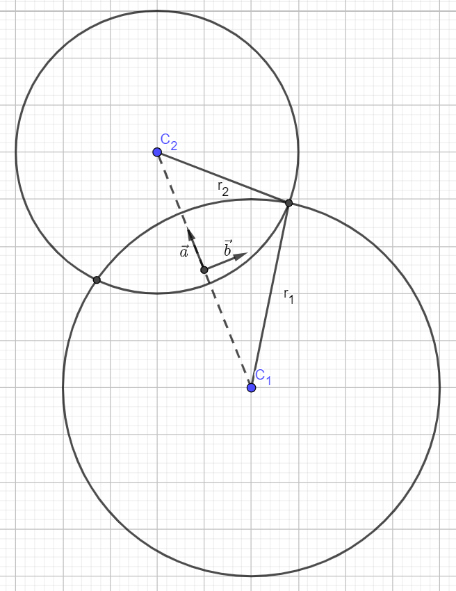

# Circle-circle intersection

Obtained from [math.stackexchange.com/questions/256100/](https://math.stackexchange.com/questions/256100/how-can-i-find-the-points-at-which-two-circles-intersect).

## Solution
Intersection points of a circle of radius \(r_1\) centered on \((x_1,y_1)\) with another circle of radius \(r_2\) centered on \((x_2,y_2)\).

The two intersection points are
$$
P_i = \begin{pmatrix}
\frac{x_1+x_2}{2}\\
\frac{y_1+y_2}{2}
\end{pmatrix}
+\frac{r_1^2-r_2^2}{2R} \begin{pmatrix}
\frac{x_1+x_2}{R}\\
\frac{y_1+y_2}{R}
\end{pmatrix}
\pm \sqrt{\frac{r_1^2+r_2^2}{2} -\left(\frac{r_1^2-r_2^2}{4R}\right)^2-\frac{R^2}{4}} \begin{pmatrix}
\frac{y_2+y_1}{R}\\
\frac{x_1+x_1}{R}
\end{pmatrix}
$$

## Derivation
### Get to an easier frame for solving
Compute the middle point
$$C_m = \begin{pmatrix}
\frac{x_1+x_2}{2}\\
\frac{y_1+y_2}{2}
\end{pmatrix}$$
and the distance between the two centers
$$ R = \sqrt{(x_2-x_1)^2 + (y_2-y_1)^2} $$
Now consider the coordinate frame with origin at \(C_m\) and unit axes

\(\vec{a} = \begin{pmatrix}
\frac{x_1+x_2}{R}\\
\frac{y_1+y_2}{R}
\end{pmatrix}\)
and
\(\vec{b} = \begin{pmatrix}
\frac{y_2+y_1}{R}\\
\frac{x_1+x_1}{R}
\end{pmatrix}\)

### Equation of circles in new coordinate frame
Usual equation of a circle is \((x-x_1)^2 + (y-y_1)^2 = r_1^2\), which is obtain from the Pythagorean theorem with \(r_1\) the hypothenuse and \((x-x_1)\) and \((y-y_1)\) its projection on \(\vec{x}\) and \(\vec{y}\) axes.

Now in our case, the circles are centered along the dashed line so their centers have no \(\vec{b}\) component. Equations are
$$(a+R/2)^2 + b^2 = r_1^2\\
(a-R/2)^2 + b^2 = r_2^2$$
Equating the two circles equation, the intersection points are obtained in the \((\vec{a},\vec{b})\) frame,
$$ a =\frac{r_1^2-r_2^2}{2R}\\
b = \sqrt{\frac{r_1^2+r_2^2}{2} -\left(\frac{r_1^2-r_2^2}{4R}\right)^2-\frac{R^2}{4}}$$
The two intersection points are thus
$$P_i = C_m + a \vec{a} \pm b \vec{b}\\
P_i =\begin{pmatrix}
\frac{x_1+x_2}{2}\\
\frac{y_1+y_2}{2}
\end{pmatrix}
+a \begin{pmatrix}
\frac{x_1+x_2}{R}\\
\frac{y_1+y_2}{R}
\end{pmatrix}
\pm b \begin{pmatrix}
\frac{y_2+y_1}{R}\\
\frac{x_1+x_1}{R}
\end{pmatrix}\\
P_i = \begin{pmatrix}
\frac{x_1+x_2}{2}\\
\frac{y_1+y_2}{2}
\end{pmatrix}
+\frac{r_1^2-r_2^2}{2R} \begin{pmatrix}
\frac{x_1+x_2}{R}\\
\frac{y_1+y_2}{R}
\end{pmatrix}
\pm \sqrt{\frac{r_1^2+r_2^2}{2} -\left(\frac{r_1^2-r_2^2}{4R}\right)^2-\frac{R^2}{4}} \begin{pmatrix}
\frac{y_2+y_1}{R}\\
\frac{x_1+x_1}{R}
\end{pmatrix}
$$

### Check for existence
The intersection only exists if \(R<r_1 + r_2\) and \(R>|r_2-r_1|\) (with \(|\cdot |\) the notation for absolute value).

First, \(a\) is obstained by subtracting the second to the first equation,

$$(a+R/2)^2 - (a-R/2)^2 = r_1^2 - r_2^2\\
a^2 + a R + (R/2)^2 - \left(a^2 - aR + (R/2)^2\right) = r_1^2-r_2^2\\
a =\frac{r_1^2-r_2^2}{2R}$$

Then \(b\) is obtained by adding the first and second equations,

$$2b^2 = r_1^2+r_2^2 - (a+R/2)^2 - (a-R/2)^2\\
2b^2 = r_1^2+r_2^2 -\left(\frac{r_1^2-r_2^2}{2R}\right)^2-\frac{r_1^2-r_2^2}{2} - R^2/4\\
 - \left(\frac{r_1^2-r_2^2}{2R}\right)^2+\frac{r_1^2-r_2^2}{2} - R^2/4\\
2b^2 = r_1^2+r_2^2 -2\left(\frac{r_1^2-r_2^2}{2R}\right)^2 - 2R^2/4\\
b = \sqrt{\frac{r_1^2+r_2^2}{2} -\left(\frac{r_1^2-r_2^2}{4R}\right)^2-\frac{R^2}{4}}$$
