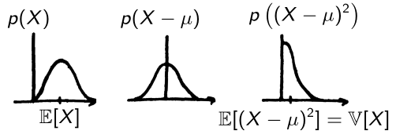

# Gaussian variables
## Definition
A Gaussian (or **normal**) **random variable** \(X\) has the probability density function (PDF)
$$
f_X(x) = \frac{1}{\sqrt{2\pi\sigma^2}}e^{-\frac{1}{2}\frac{(x-\mu)^2}{\sigma^2}}
$$
!!! note "Dimension \(n\)"
     $$
     f_X(x) = \frac{1}{(2\pi)^{n/2}|\Sigma|^{1/2}}e^{-\frac{1}{2}(x-\mu)^\top \Sigma ^{-1}(x-\mu)}
     $$
It is fully described by two parameters, its **mean** \(\mu\) and **variance** \(\sigma\) (or \(\Sigma\)).  
We write \(X\sim \mathcal{N}(\mu,\sigma^2)\), or \(X\sim \mathcal{N}(\mu,\Sigma)\).  
The **standard** normal distribution is \(\mathcal{N}(0,1)\).
## Mean and Variance
$$
\mu = \mathbb{E}[X] = \int_\mathbb{R}xf(x)dx\\
\sigma = \mathbb{V}[X] = \mathbb{E}[(X-\mu)^2]
$$
{: style="display: block; margin: 0 auto; width: 300px"}
!!! note "dimension \(n\)"
     $$
     \begin{aligned}
     \mu &= \begin{pmatrix}
     \mathbb{E}_{x_1}[X] \\
     \vdots \\
     \mathbb{E}_{x_n}[X]
     \end{pmatrix}\\
     \Sigma &= \mathbb{E}\left[\left(X-\mu\right)\left(X-\mu\right)^\top\right]
     \end{aligned}
     $$
## Linear transformation
Consider the affine transformation \(Y=AX+b\) where \(X\sim \mathcal{N}(\mu_X, \Sigma_X)\). The obtained \(Y\) also has a normal distribution with
$$
\begin{aligned}
\mu_Y &= A\mu_X + b \\
\Sigma_Y &= A\Sigma_X A^\top
\end{aligned}
$$

Proof

$$
\begin{aligned}
\mu_Y &= \mathbb{E}[AX+b] \\
&= A\mathbb{E}[X] + b \\
&= A\mu_X + b \\
\Sigma_Y &= \mathbb{E}[(Y-\bar y)(Y-\bar y)^\top] \\
&= \mathbb{E}[(AX+b - A\mu_X-b)(AX+b - A\mu_X-b)^\top] \\
&= \mathbb{E}[A(X-\mu_X)(X-\mu_X)^\top A^\top] \\
&= A\Sigma_X A^\top
\end{aligned}
$$

\(Y=AX+b+\epsilon\)

Adding a gaussian noise \(\epsilon\sim\mathcal{N}(0,\Sigma_\epsilon)\) gives
$$
\begin{aligned}
\mu_Y &= A\mu_X + b \\
\Sigma_Y &= A\Sigma_X A^\top + \Sigma_\epsilon
\end{aligned}
$$

## Confidence region
The minimal volume which contains \(X\) with a given probability. For a Gaussian variable, it is an ellipsoid.
!!! info "radius of confidence region for standard normal distribution"
     Probability \(\eta\) to be at a distance of less than \(a\) from \(\mu\)
     $$
     \begin{aligned}
     \eta &= \mathbb{P}(\|X\| \leq a) \\
     &= \mathbb{P}(X^\topX \leq a^2) \\
     &= \int_0^{a^2}\frac{1}{2}e^{}
     \end{aligned}
     $$

# push
# back
# these
# lines

